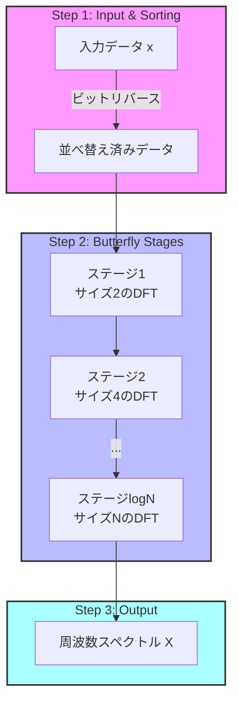

## はじめに

情報系の学生にとって、**高速フーリエ変換** は避けては通れない、そして最も美しいアルゴリズムの一つです。
音声認識、画像圧縮 (JPEG)、通信 (5G/Wi-Fi)、そして最近の機械学習に至るまで、現代のデジタル社会はFFTの上に成り立っていると言っても過言ではありません。

この記事では、単なる数式の羅列ではなく、**なぜFFTはこんなに速いのか？** そして**具体的にメモリの中で何が起きているのか？** という疑問に、アルゴリズムの挙動を可視化しながら答えていきます。
数学的なパズルを解くような感覚で、この革命的なアルゴリズムの仕組みを紐解いていきましょう。

---

## 1. フーリエ変換の系譜：時間から周波数へ

### 1.1 「成分」を見るということ

私たちは普段、世界を時間の流れで捉えています。マイクで録音した音声データは、横軸が時間、縦軸が空気の振動（振幅）を表すグラフになります。
しかし、この**時間領域** のデータだけでは、情報の「中身」はよく分かりません。

例えば、ピアノで「ド・ミ・ソ」の和音を弾いたとします。波形は複雑に干渉し合い、ギザギザした形になります。この波形を見ただけで「あ、これはCメジャーコードだ」と判別するのは至難の業です。

ここで登場するのが**周波数領域** への変換です。
フーリエ変換を行うと、その複雑な波形が「ド(約261Hz)」「ミ(約329Hz)」「ソ(約392Hz)」という**単純な成分の足し合わせ**であることが一瞬で分かります。

---

## 2. 離散フーリエ変換 (DFT) の仕組み

コンピュータで信号をあつかう場合、データは連続ではなく、一定間隔でサンプリングされた点列になります。この離散データに対する変換を **離散フーリエ変換** と呼びます。

### 2.1 定義式と「回転」のイメージ

長さ $N$ の信号 $x(n)$ に対するDFTは、以下の式で定義されます。

$$
X(k) = \sum_{n=0}^{N-1} x(n) W_N^{kn} \quad (k=0,1,\ldots,N-1)
$$

この式の核心は $W_N$ という **回転因子** にあります。

$$
W_N = e^{-j\frac{2\pi}{N}} = \cos\left(\frac{2\pi}{N}\right) - j\sin\left(\frac{2\pi}{N}\right)
$$

これは、複素平面上を **時計回りに $1/N$ 周（角度 $360^\circ/N$）回転させる** という意味です。
つまり $W_N^{kn}$ は、その回転を $k \times n$ 回繰り返すことを表します。

DFTの式全体を直感的に翻訳すると、こうなります。
入力信号 $x(n)$ に対して、周波数 $k$ に対応するスピードで回転させながら和をとる（＝どれくらい共鳴するかを調べる）

### 2.2 $O(N^2)$ の壁

DFTの理論は完璧ですが、致命的な弱点があります。**計算量**です。

$X(k)$ を1つ計算するのに $N$ 回の掛け算が必要です。
スペクトル全体（$k=0$ から $N-1$ まで）を求めるには、$N \times N = N^2$ 回の乗算が必要になります。

*   $N=1,000$ (1千) なら、1,000,000 (100万) 回。まだ余裕です。
*   $N=1,000,000$ (100万) なら、$1,000,000,000,000$ (**1兆**) 回。

1兆回の計算は、最新のCPUでも数秒〜数十秒かかります。リアルタイムな音声処理や高解像度の画像処理を行う場合、この $O(N^2)$ という重さは致命的なボトルネックでした。この壁を打ち破ったのが FFT です。

---

## 3. Cooley-Tukey法

1965年、CooleyとTukeyは **大きな問題を、同じ構造を持つ小さな問題に分割する分割統治法**を利用することで、計算量を劇的に減らせることを示しました。

### 3.1 偶数と奇数への分割

アイデアは単純です。$N$ 個のデータを、**偶数番目** と **奇数番目** の2つのグループ（サイズ $N/2$）に分けたらどうなるでしょうか？

$$
\begin{aligned}
X(k) &= \underbrace{\sum_{m=0}^{N/2-1} x(2m) W_N^{k(2m)}}_{\text{偶数番目}} + \underbrace{\sum_{m=0}^{N/2-1} x(2m+1) W_N^{k(2m+1)}}_{\text{奇数番目}} \\
&= \sum_{m=0}^{N/2-1} x(2m) (W_N^2)^{km} + W_N^k \sum_{m=0}^{N/2-1} x(2m+1) (W_N^2)^{km}
\end{aligned}
$$

ここで、「$N$人で円を一周するステップを2倍速で進む」ことは、「$N/2$人で円を一周する」ことと同じです。数学的にはこう書けます。

$$
W_N^2 = W_{N/2}
$$

これにより、DFTの式は以下のように書き換えられます。

$$
X(k) = E(k) + W_N^k O(k)
$$

*   $E(k)$: 偶数番目データ列（サイズ$N/2$）のDFT結果
*   $O(k)$: 奇数番目データ列（サイズ$N/2$）のDFT結果

つまり、**サイズ $N$ のDFTは、サイズ $N/2$ のDFT 2個に分割できる** のです。

### 3.2 周期性の利用（バタフライ演算の出現）

「半分に分割できたのはいいけど、結局 $k$ は $0 \sim N-1$ まで計算するから、計算回数は変わらないのでは？」と思うかもしれません。
ここで、回転因子の「周期性」と「対称性」を使います。

$$
W_N^{k + N/2} = -W_N^k
$$

円の反対側（180度回転した位置）では、符号が反転するだけです。これを利用すると、後半部分（$k \ge N/2$）の計算は、前半部分の結果を**そのまま使い回す**ことができます。

1.  **前半 ($k < N/2$):** $X(k) = E(k) + W_N^k O(k)$
2.  **後半 ($k \ge N/2$):** $X(k + N/2) = E(k) - W_N^k O(k)$

見てください。$E(k)$ と $O(k)$ を一度計算すれば、あとは「足すだけ」と「引くだけ」で2つの答えが同時に求まります。これが **バタフライ演算** の正体です。

---

## 4. アルゴリズムの実装と可視化

理論が分かったところで、**実際にコンピュータの中でデータがどう動くのか**に注目してみましょう。

### 4.1 ビットリバース：カオスの秩序

アルゴリズムを開始する前準備として、データの並び替えを行います。
「偶数・奇数」への分割を再帰的に繰り返すと、データは一見バラバラな順序になりますが、これはインデックスを2進数で表して**ビットを逆順（リバース）**にした並びと一致します。

**例：$N=8$ の場合のデータの行方**

| 元の順序 (10進数) | 2進数 (Bits) | **ビット反転** | 反転後 (10進数) | データの配置 |
| :---: | :---: | :---: | :---: | :--- |
| 0 | 000 | 000 | **0** | $x(0)$ |
| 1 | 001 | 100 | **4** | $x(4)$ |
| 2 | 010 | 010 | **2** | $x(2)$ |
| 3 | 011 | 110 | **6** | $x(6)$ |
| 4 | 100 | 001 | **1** | $x(1)$ |
| 5 | 101 | 101 | **5** | $x(5)$ |
| 6 | 110 | 011 | **3** | $x(3)$ |
| 7 | 111 | 111 | **7** | $x(7)$ |

最初にこの並び替えを行っておくことで、メモリ上でデータをあちこち動かすことなく、隣り合うデータ同士をパタパタと畳んでいく（バタフライ演算する）だけで計算が完結します。

### 4.2 バタフライ演算とIn-place計算

ビットリバースされたデータに対し、バタフライ演算を適用していきます。
計算の最小単位は以下の連立式です。

$$
\left\{
\begin{aligned}
A' &= A + W \cdot B \\
B' &= A - W \cdot B
\end{aligned}
\right.
$$

この演算の最大のメリットは、**In-place（その場での）計算**が可能であることです。
入力 $A, B$ が格納されていたメモリ領域に、計算結果 $A', B'$ をそのまま上書きしても、他の計算に影響を与えません。これにより、余分なメモリを使わず、キャッシュ効率も極めて高い高速な動作が可能になります。

### 4.3 圧倒的な計算速度の正体

最終的に、計算量はどうなるでしょうか。

*   分割の深さ： $N$ を半分にし続けるので、$\log_2 N$ 段になります。
*   各段の計算： 全てのデータに対してバタフライ演算を行うので、オーダーは $N$ です。

これらを掛け合わせると、全体の計算量は **$O(N \log N)$** となります。

**$N=1,000,000$ (100万) の場合**
*   DFT ($N^2$): **1兆回**
*   FFT ($N \log N$): $10^6 \times 20 \approx$ **2000万回**

**1兆回 vs 2000万回**。これがFFTが「現代の魔法」と呼ばれる理由です。何日もかかる計算が一瞬で終わるようになったからこそ、私たちはスマホでリアルタイムに動画を見たり、音声アシスタントを使ったりできるのです。

---

## 5. アルゴリズムの実行フロー（全体像）

最後に、FFTアルゴリズムが具体的にどのような手順で実行されるのかを可視化します。
データがどのように変形され、最終的なスペクトルに至るのかを確認してください。

### 各ステップの詳細

1.  **Bit Reversal Sorting**:
    データをメモリ上で「飛び飛び」にアクセスしなくて済むよう、最初に並べ替えます。
2.  **Butterfly Loop**:
    $\log_2 N$ 回のステージを繰り返します。ステージが進むごとに、計算対象のブロックサイズが $2, 4, 8, \dots, N$ と倍になっていきます。
3.  **Output**:
    最終的な配列には、周波数順 ($0 \sim N-1$) に成分の値が格納されます。

---

## 6. まとめ

FFTは、単なる高速化テクニックではありません。「分割統治」「対称性の利用」「ビット操作」といった、アルゴリズム設計のエッセンスが凝縮された芸術作品です。

1.  **DFTの課題**: そのまま計算すると $N^2$ で遅すぎる。
2.  **分割統治**: 偶数・奇数に分けると、サイズ半分のDFTに帰着できる。
3.  **回転因子の性質**: 周期性を利用して、計算結果を使い回す（バタフライ演算）。
4.  **実装の工夫**: ビットリバースでデータを並べ替え、メモリ効率を最大化する。

この流れを理解すれば、FFTはもはやブラックボックスではありません。この知識は、信号処理のライブラリを使う際や、他の再帰的アルゴリズムを学ぶ際にも、強力な武器となるはずです。