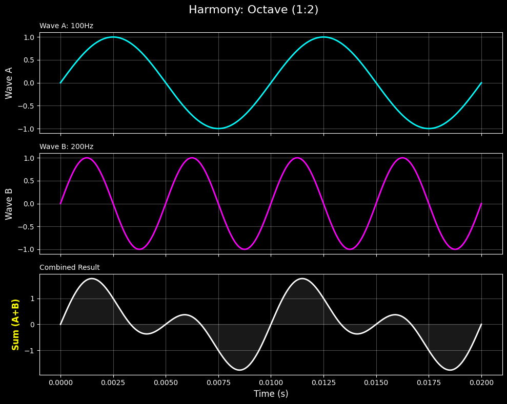
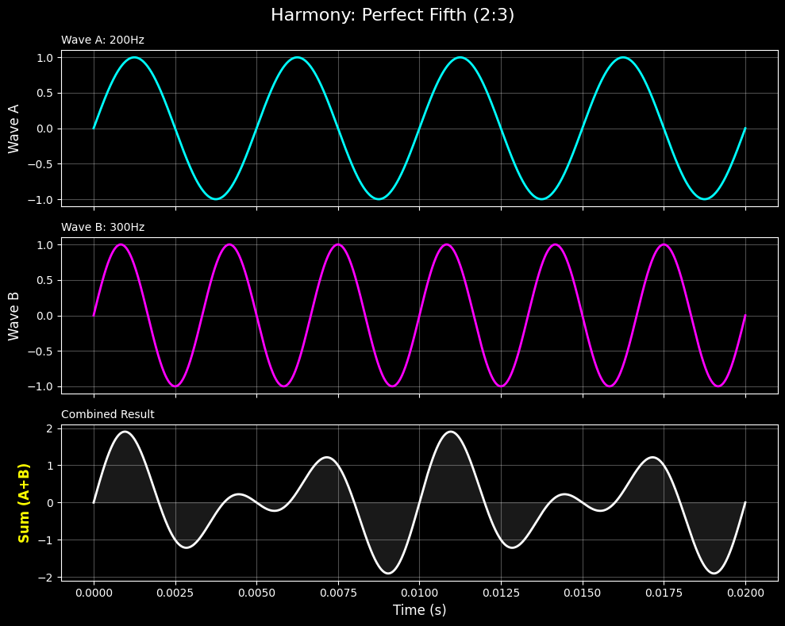
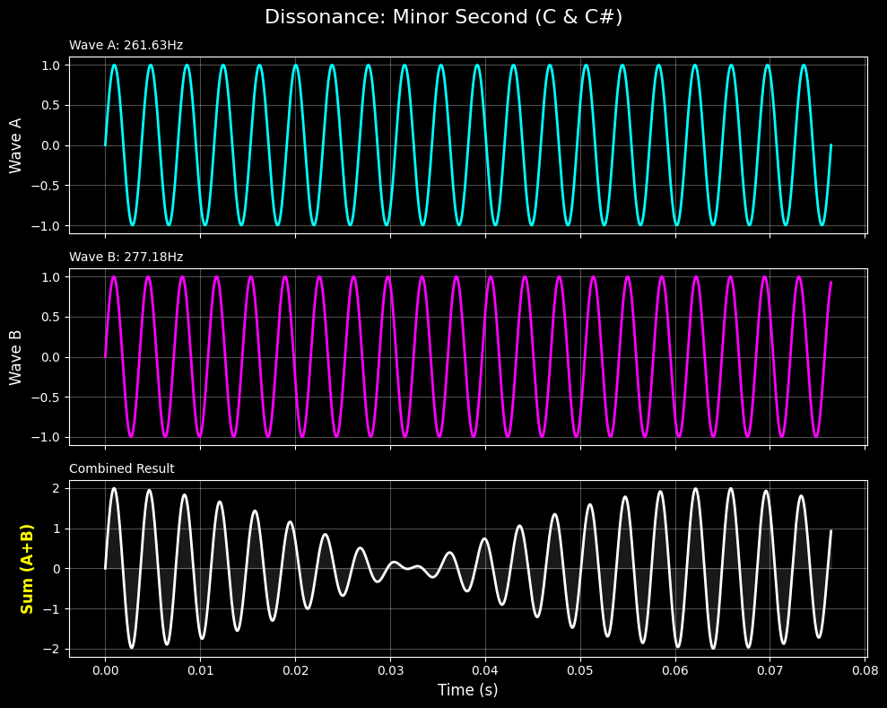
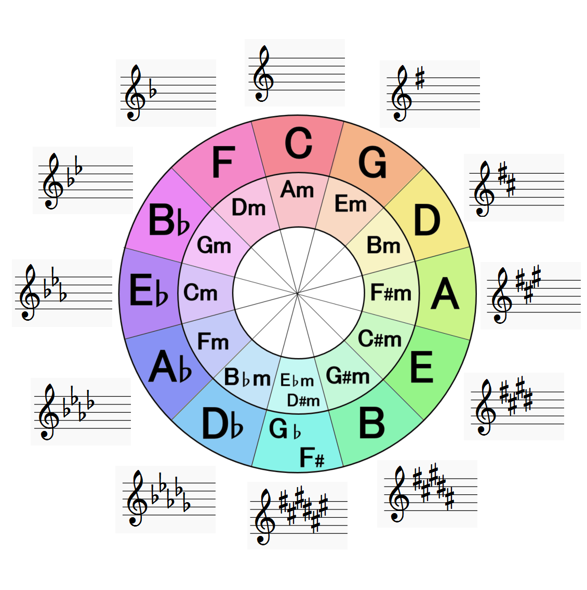

## はじめに

「音楽は感覚的な芸術だ」と思われがちですが、その根底には厳密な**数学的法則**が支配しています。
なぜ「ド」と「ソ」は綺麗に響くのか？なぜ「ド」と「ド#」は不快に感じるのか？

その答えは、すべて**空気の振動（周波数）の比率**に隠されています。
今回は、Pythonで生成した実際の波形と音源を使って、音楽という芸術の裏側にある「数学的な美しさ」と、それゆえに生じる「避けられない矛盾」について解説します。

---

## 1. ハーモニーの正体

私たちが「綺麗だ」と感じる和音（協和音）は、周波数の比率が**単純な整数比**になっています。
逆に、「汚い」「怖い」と感じる音（不協和音）は、この比率が複雑です。

基準となる音（ド）の周波数を $f$ として、実際に見てみましょう。

### 究極の調和：オクターブ (1:2)

最も基本的な調和は「オクターブ」です。男性の低いドと、女性の高いドのような関係です。
このとき、周波数はちょうど **2倍 (1:2)** になっています。

下の図を見てください。青い波（$f$）と赤い波（$2f$）を重ね合わせると、その合成波（白）は非常に規則的でシンプルな形をしています。


<audio controls src="/audio/octave.wav" style="width: 100%; margin: 10px 0;"></audio>

### 最も重要な響き：完全五度 (2:3)

次に相性の良い「ド」と「ソ」の関係（完全五度）は、周波数が **1.5倍 (2:3)** の関係にあります。
この比率は音楽の基礎を支える最も重要な数字です。

こちらも波の周期が定期的に一致（2回と3回で同期）するため、合成波は美しいパターンを描きます。


<audio controls src="/audio/consonance.wav" style="width: 100%; margin: 10px 0;"></audio>

---

## 2. 不協和音の正体：干渉と「うなり」

では、相性の悪い音同士では何が起きているのでしょうか？
隣り合う鍵盤、「ド」と「ド#」（短二度）を同時に弾いてみます。

比率は約 **15:16** と複雑になります。
周波数が近すぎるため、波形がお互いに干渉し合い、振幅が大きくなったり小さくなったりする**うなり** という現象が発生します。


<audio controls src="/audio/dissonance.wav" style="width: 100%; margin: 10px 0;"></audio>

合成波（一番下）を見ると、「ウワンウワン」と周期的に音が大きくなっているのが視覚的にもわかります。
この物理的な「干渉」を、人間の脳は「不快感」や「緊張」として処理しているのです。

---

## 3. 五度圏

話を「美しい比率（2:3）」に戻しましょう。
音楽の世界には**五度圏 (Circle of Fifths)** という美しい図があります。



これは、「ド」からスタートして、周波数を **1.5倍** （完全五度）にする計算を繰り返して並べたものです。

1.  ド $\times 1.5 \rightarrow$ ソ
2.  ソ $\times 1.5 \rightarrow$ レ
3.  レ $\times 1.5 \rightarrow$ ラ ...

これを繰り返していくと、シャープやフラットを経由しながら、**12回目でまた「ド」に戻ってきます**。
この「循環」こそが、私たちが普段使っている「12音階」の正体です。

---

## 4. 数学が突きつける「矛盾」：ピタゴラスコンマ

しかし、ここに衝撃的な事実があります。
**「純粋な数学的計算では、元の場所には絶対に戻れない」** のです。

実際にPythonを使って計算してみましょう。
「1.5倍を12回繰り返した音」と「2倍（オクターブ）を7回繰り返して到達する同じ高さの音」を比較します。

```python
# 基準の周波数 (C)
base_freq = 100.0

# 五度圏を1周する (1.5倍を12回繰り返す)
circle_freq = base_freq * (1.5 ** 12)

# 単純にオクターブだけで同じ高さまで上げる (2倍を7回繰り返す)
octave_freq = base_freq * (2 ** 7)

print(f"五度圏ルート: {circle_freq:.2f}")
print(f"オクターブルート: {octave_freq:.2f}")

print(f"ズレ (比率): {circle_freq / octave_freq:.5f}")
```

**実行結果:**

| 計算ルート | 到達する数値 |
| :--- | :--- |
| 五度圏ルート ($1.5^{12}$) | **129.74...** |
| オクターブルート ($2^7$) | **128.00** |

$$
{1.5}^{12} \neq {2}^{7}
$$

計算すると、約 **1.36%** のズレが生じます。
12回きっちり回って戻ってきたはずなのに、**ほんの少しだけ行き過ぎてしまう**のです。
この、数学的にどうしても埋められない微細な隙間のことを、古代の数学者の名をとって**「ピタゴラスコンマ」**と呼びます。

---

## 5. 妥協が生んだ「平均律」という発明

この矛盾をどう解決するか？
歴史上、多くの音楽家や数学者がこの問題に頭を悩ませてきました。

「純正なハモリ（2:3）」を優先すると、円が閉じないため、転調（キーを変えること）ができなくなります。
そこで現代の音楽論が出した結論は、**「ズレを全員で分け合う」** ことでした。

1.36%のズレを、12個の音すべてに均等に割り振って、少しずつ「我慢」させたのです。
これを**平均律 (Twelve-tone equal temperament)** といいます。

平均律のピアノで弾く「ド」と「ソ」は、実は厳密な 2:3 ではありません。ほんの少しだけ濁っています。
しかし、そのわずかな濁りを許容することで、私たちは**「自由に転調できる」**という無限の可能性を手に入れました。

## まとめ

音楽は数学的な美しさ（単純な整数比）を追求するところから始まりましたが、最後にはその数学的な完全性を**意図的に壊す**ことで完成しました。

- 波形が重なる＝美しい
- 波形が干渉する＝怖い
- 完全性を少し捨てると＝自由になれる

もし次にピアノやギターの音を聞く機会があれば、その裏側にある「計算された妥協」に思いを馳せてみてください。
それは、非合理な人間らしさそのものなのかもしれません。