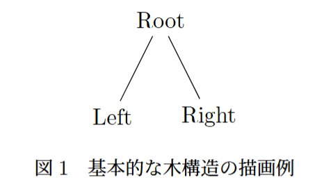
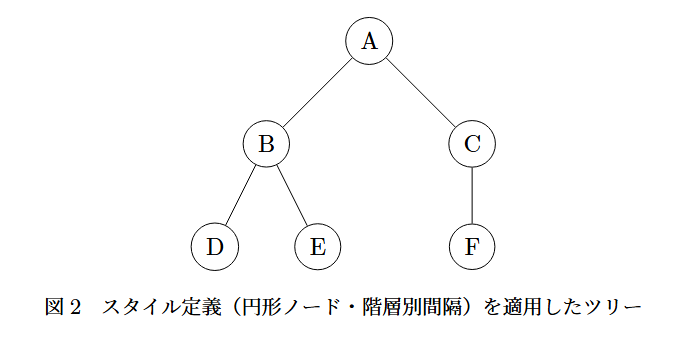
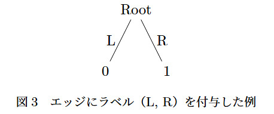
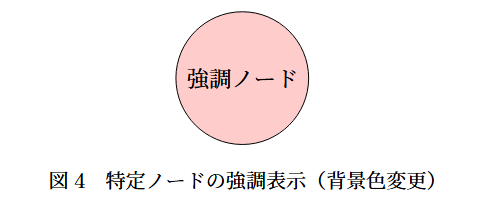

## はじめに

## 1. TikZで木を描くための基本構文
TikZの木構造は、`node`と`child`というキーワードを使って階層的に記述します。

まずは、最もシンプルな3ノードの木を見てみましょう。

```latex
\begin{figure}[htbp]
    \centering
    \begin{tikzpicture}
        \node {Root}
        child { node {Left} }
        child { node {Right} };
    \end{tikzpicture}
    \caption{基本的な木構造の描画例}
    \label{fig:simple-tree}
\end{figure}
```

- `\begin{figure}[htbp]`: 図を定義します。`[htbp]`は図をどこに配置するかを指定します。
- `\begin{tikzpicture}[...]`: TikZ図を定義します。
- `node {内容}`: 各ノードを定義します。
- `child { ... }`: 子ノードを定義します。この中にさらに`node`を入れることで階層を深くできます。



## 2. スタイルを整える
デフォルトのままだと、ノード同士が重なったり、見た目が少し寂しかったりします。そこで、`level`ごとのスタイルを指定して整えましょう。

```latex
\begin{figure}[htbp]
    \centering
    \begin{tikzpicture}[
            nodes={draw, circle},
            level 1/.style={sibling distance=3cm},
            level 2/.style={sibling distance=1.5cm}
        ]
        \node {A}
        child { node {B}
                child { node {D} }
                child { node {E} }
            }
        child { node {C}
                child { node {F} }
            };
    \end{tikzpicture}
    \caption{スタイル定義（円形ノード・階層別間隔）を適用したツリー}
    \label{fig:styled-tree}
\end{figure}
```

- `sibling distance`: 同じ階層の兄弟ノード同士の間隔を指定します。
- `level distance`: 親子ノード同士の間隔を指定します。
- `draw`: ノードを囲う枠を描きます。
- `circle`: ノードを円で囲みます。



## 3. 応用テクニック
### 3.1 枝にラベルを付ける
ハフマン符号やパトリシア木など、枝に情報を載せたい場合は`edge from parent node`を用います。

```latex
\begin{figure}[htbp]
    \centering
    \begin{tikzpicture}
        \node {Root}
        child { node {0} edge from parent node[left] {L} }
        child { node {1} edge from parent node[right] {R} };
    \end{tikzpicture}
    \caption{エッジにラベル（L, R）を付与した例}
    \label{fig:edge-labels}
\end{figure}
```



### 3.2 特定のノードの色を変える
赤黒木などでは、特定ノードを強調したいことがあります。

```latex
\begin{figure}[htbp]
    \centering
    \begin{tikzpicture}
        \node[fill=red!20, draw, circle] {強調ノード};
    \end{tikzpicture}
    \caption{特定ノードの強調表示（背景色変更）}
    \label{fig:highlighted-node}
\end{figure}
```



## 4. さらに効率化したいときは
TikZの標準機能でも十分書けますが、より複雑な木を効率的に書きたい場合は、TikZをベースにした`forest`パッケージがおすすめです。

https://ctan.org/pkg/forest

階層構造を`[]`だけで記述でき、**コードが圧倒的に短くなる**ことと、ノードが重ならないよう**自動的に配置してくれる**ことが特徴です。

## まとめ
TikZを用いた木構造の描き方について解説しました！ぜひ活用してみてください！