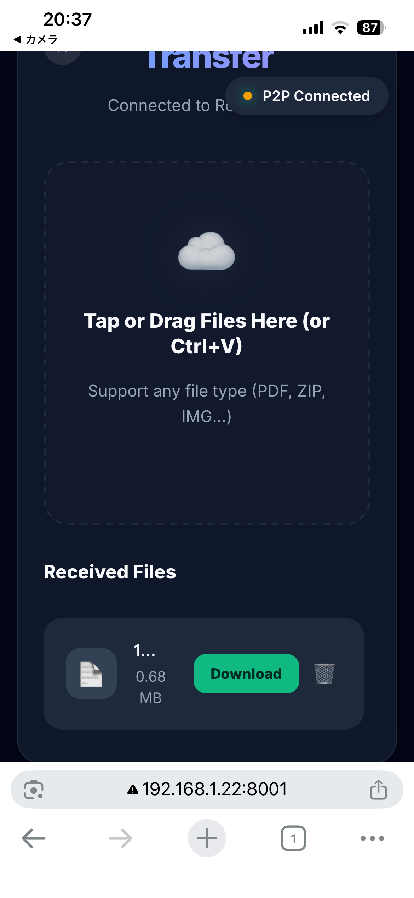

## はじめに

普段、私たちはファイルを送るときに何を使っているでしょうか？ Google Drive、Dropbox、LINE、Slack...。これらは全て**クライアント・サーバー型（Client-Server）**のサービスです。ファイルを一度クラウド上のサーバーにアップロードし、相手がそれをダウンロードする。これは非常に便利で、バックアップとしての役割も果たします。

しかし、**今すぐ隣にいる友達にGB単位の動画ファイルを渡したい**というシーンを想像してください。
インターネットを経由してサーバーにアップロードし、またダウンロードする。これには二重の時間がかかり、回線帯域も消費します。機密情報であれば、第三者のサーバーにデータを預けること自体がリスクになり得ます。

**WepDrop**は、この課題を解決するために作られた**P2P（Peer-to-Peer）ファイル転送アプリケーション**です。

サーバーを介さず、ブラウザ同士が直接通信路を確立し、データを流し込みます。
このアーキテクチャには以下のメリットがあります。

1.  **圧倒的な速度**: ローカルネットワーク（LAN）内であれば、インターネット回線の速度制限を受けません。Wi-Fiルーターの理論値上限（例: 1Gbpsオーバー）で転送可能です。
2.  **プライバシー**: データはサーバーを通過しません。通過するのは「接続するための情報」だけ。ファイルの中身は誰にも見られません。
3.  **サイズ制限なし**: サーバーのストレージ容量に依存しないため、ブラウザが扱える限り、何GBでも転送可能です。

本記事では、WebDropを支える技術スタック、アーキテクチャ、そして開発中に直面した**ブラウザで巨大ファイルを送るという課題**をどう乗り越えたのか、深掘りしていきたいと思います。

なお、開発したアプリケーションは以下から利用することができます。

https://github.com/97kuek/WebDrop


*起動画面、QRコードでスマホ側のブラウザを起動することができる*

*スマホ側のブラウザで起動した画面*

---

## Vanilla

モダンなWeb開発ではReactやVue.jsが主流ですが、WebDropではあえて**Vanilla JS（フレームワークなしの素のJavaScript）**を採用しました。

| カテゴリ | 技術 | 選定理由 |
| :--- | :--- | :--- |
| **Backend** | **Python (FastAPI)** | 非同期処理(`async/await`)が得意で、WebSocketサーバーの実装が非常にシンプルかつ高速に記述できるため。 |
| **Protocol** | **WebSockets** | P2P接続を確立する前の「お見合い（シグナリング）」に使用。低遅延な双方向通信が必須。 |
| **Core** | **WebRTC** | ブラウザ標準のP2P通信API。プラグイン不要で、SRTPによる暗号化通信が可能。 |
| **Frontend** | **Vanilla JS (ES6+)** | フレームワークのオーバーヘッドを排除し、`Blob`や`ArrayBuffer`のメモリ管理を完全に制御下におくため。GB級の転送においてGC（ガベージコレクション）によるカクつき（Jank）は致命的です。 |
| **Styling** | **CSS Variables** | ランタイムコストゼロのテーマ切り替えと、Glassmorphism（すりガラス）デザインの実現。 |

---

## アーキテクチャ詳解

WebDropのシステムは大きく分けて**Signaling Server（仲介役）**と**Peer（ブラウザ）**の2つで構成されています。


```mermaid
graph TD
    subgraph "Signaling Phase (The Handshake)"
    A[User A] -.->|1. WebSocket| S[Signaling Server (FastAPI)]
    B[User B] -.->|1. WebSocket| S
    A -.->|2. SDP Offer| S
    S -.->|2. SDP Offer| B
    B -.->|3. SDP Answer| S
    S -.->|3. SDP Answer| A
    end

    subgraph "Data Transfer Phase (P2P)"
    A ===|4. WebRTC DataChannel (Direct)| B
    end

    style S fill:#f9f,stroke:#333
    style A fill:#bbf,stroke:#333
    style B fill:#bbf,stroke:#333
```


### 1. シグナリング

WebRTCでP2P通信を行うには、互いに以下の情報を交換する必要があります。
これを**シグナリング**と呼びます。

*   **SDP (Session Description Protocol)**: 「私はビデオを送れるか？」「どんなコーデックに対応しているか？」といった自己紹介カード。
*   **ICE Candidates**: 「私のIPアドレスはこれ」「ポートはこれ」といった接続先の候補地リスト。

シグナリングサーバーは、この情報を右から左へ受け流すだけの存在です。

#### バックエンド実装 (FastAPI)

PythonのFastAPIを使えば、WebSocketサーバーは驚くほど簡潔に書けます。

```python
# server.py (Simplified)
from fastapi import FastAPI, WebSocket, WebSocketDisconnect

app = FastAPI()

class ConnectionManager:
    def __init__(self):
        # 部屋ごとの接続リスト {room_id: [websocket1, websocket2]}
        self.active_connections: dict[str, list[WebSocket]] = {}

    async def connect(self, websocket: WebSocket, room_id: str):
        await websocket.accept()
        if room_id not in self.active_connections:
            self.active_connections[room_id] = []
        self.active_connections[room_id].append(websocket)

    async def broadcast(self, message: dict, room_id: str, sender: WebSocket):
        # 同じ部屋の自分以外の人にメッセージを転送
        for connection in self.active_connections[room_id]:
            if connection != sender:
                await connection.send_json(message)

manager = ConnectionManager()

@app.websocket("/ws/{room_id}")
async def websocket_endpoint(websocket: WebSocket, room_id: str):
    await manager.connect(websocket, room_id)
    try:
        while True:
            data = await websocket.receive_json()
            # 受け取ったSDPやICE Candidateをそのまま転送
            await manager.broadcast(data, room_id, websocket)
    except WebSocketDisconnect:
        manager.disconnect(websocket, room_id)
```

このコードだけで、基本的なWebRTCのシグナリングサーバーとして機能します。

---

## WebRTCの実装：接続の確立

フロントエンドでは、`RTCPeerConnection` APIを使用します。
手順は複雑に見えますが、「Offer（申込書）を作って送る」「Answer（回答書）を作って返す」という流れです。

```javascript
// main.js (Concept)
const config = {
    iceServers: [{ urls: 'stun:stun.l.google.com:19302' }] // GoogleのSTUNサーバーを使用
};

const peerConnection = new RTCPeerConnection(config);

// 1. データチャネルの生成（これがファイルを送る土管になる）
const dataChannel = peerConnection.createDataChannel("fileTransfer");

// 2. Offerの作成と送信
async function startCall() {
    const offer = await peerConnection.createOffer();
    await peerConnection.setLocalDescription(offer);
    
    // WebSocket経由で相手に送信
    signalingSocket.send(JSON.stringify({ type: 'offer', sdp: offer }));
}

// 3. 相手からのAnswerを受け取った時
async function handleAnswer(answer) {
    await peerConnection.setRemoteDescription(new RTCSessionDescription(answer));
}

// 4. 経路候補（ICE Candidate）が見つかった時
peerConnection.onicecandidate = (event) => {
    if (event.candidate) {
        signalingSocket.send(JSON.stringify({ type: 'candidate', candidate: event.candidate }));
    }
};
```

**STUNサーバー**とは？
お互いのPCは通常、ルーターの内側（プライベートIPアドレス）にいます。インターネット越しに直接通信するには、自分の「グローバルIPアドレス」を知る必要があります。それを教えてくれるのがSTUNサーバーです。Googleが公開している無料のSTUNサーバーを利用するのが一般的です。

---

## 技術的な最難関：巨大ファイルの送信制御

ここからがWebDrop開発のハイライトです。
WebRTCの `DataChannel` を使ってファイルを送る際、ただ `send(file)` とするだけでは**100%失敗します**。

### 問題点：バックプレッシャーの欠如
ブラウザのJavaScriptはシングルスレッドです。数GBのファイルを一度に `send()` しようとすると、ブラウザのメモリが枯渇するか、メインスレッドがブロックされてUIが完全にフリーズ（応答なし）します。Chromeであれば "Aw, Snap!" でクラッシュするでしょう。

### 解決策：チャンク分割とバッファ制御

これを解決するために、以下の戦略をとりました。

1.  **Chunking**: ファイルを64KB程度の小さな断片（チャンク）に切り分ける。
2.  **Backpressure**: ブラウザ内部の送信バッファ（`bufferedAmount`）を監視し、バッファが溢れそうなら送信を一時停止する。

#### 実装コード詳解

```javascript
const CHUNK_SIZE = 64 * 1024; // 64KB
const MAX_BUFFER_AMOUNT = 16 * 1024 * 1024; // 16MB (これ以上溜めたくない閾値)

async function sendFile(file) {
    const fileReader = new FileReader();
    let offset = 0;

    // 非同期ループで処理
    while (offset < file.size) {
        // 現在のバッファ残量をチェック
        if (dataChannel.bufferedAmount > MAX_BUFFER_AMOUNT) {
            // バッファがいっぱいなら、少し待機してイベントループを回す
            // これによりブラウザが裏でデータを送信し、バッファが空くのを待つ
            await new Promise(resolve => setTimeout(resolve, 10));
            continue; // ループの先頭に戻って再チェック
        }

        // ファイルをスライスして読み込む
        const slice = file.slice(offset, offset + CHUNK_SIZE);
        const buffer = await slice.arrayBuffer();
        
        // 送信
        dataChannel.send(buffer);
        
        offset += slice.size;
        
        // プログレスバー更新
        updateProgress(offset / file.size);
    }
}
```

この `await new Promise(...)` が魔法のように機能します。
送信ペースをネットワークの帯域幅に自動的に合わせる（＝バックプレッシャー制御）ことで、**メモリ消費を一定に保ちながら、GBクラスのファイルでも安定して送信**できるようになります。

---

## UI/UXへのこだわり：Glassmorphism

WebDropは、使い心地（UX）にもこだわっています。
デザインコンセプトは **"Glassmorphism"（すりガラス）** です。


### CSS Variablesによるテーマ管理

モダンなデザインを実現するために、CSS変数を全面的に採用しています。

```css
:root {
    --glass-bg: rgba(255, 255, 255, 0.1);
    --glass-border: rgba(255, 255, 255, 0.2);
    --glass-shadow: 0 8px 32px 0 rgba(31, 38, 135, 0.37);
    --text-primary: #ffffff;
}

.glass-panel {
    background: var(--glass-bg);
    backdrop-filter: blur(12px); /* すりガラス効果 */
    -webkit-backdrop-filter: blur(12px); /* Safari対応 */
    border: 1px solid var(--glass-border);
    box-shadow: var(--glass-shadow);
    border-radius: 16px;
}
```

`backdrop-filter: blur()` を使うことで、背面の要素がぼやけて透ける、Apple製品のような高級感のあるUIを実現しています。

---

## まとめ

WebDropは、「ファイルを送る」というシンプルな行為を、現代のWeb技術（WebRTC, WebSocket, FastAPI）を駆使して再発明するプロジェクトでした。

特に、**WebRTC DataChannelのバッファ制御**は、ドキュメントも少なく、実験と計測を繰り返して辿り着いた実装です。「ブラウザだけでここまでできる」という可能性を感じていただければ幸いです。

### Future Work
-   **Folder Transfer**: 現在は単一ファイルのみですが、ディレクトリ構造ごとの転送に対応したいと考えています（JSの `webkitGetAsEntry` APIを使用）。
-   **End-to-End Encryption Customization**: WebRTCは標準で暗号化されますが、さらにパスワードによる共通鍵暗号化層を追加することで、よりセキュアな転送を目指します。

WebDropで、快適なファイル転送ライフを！
