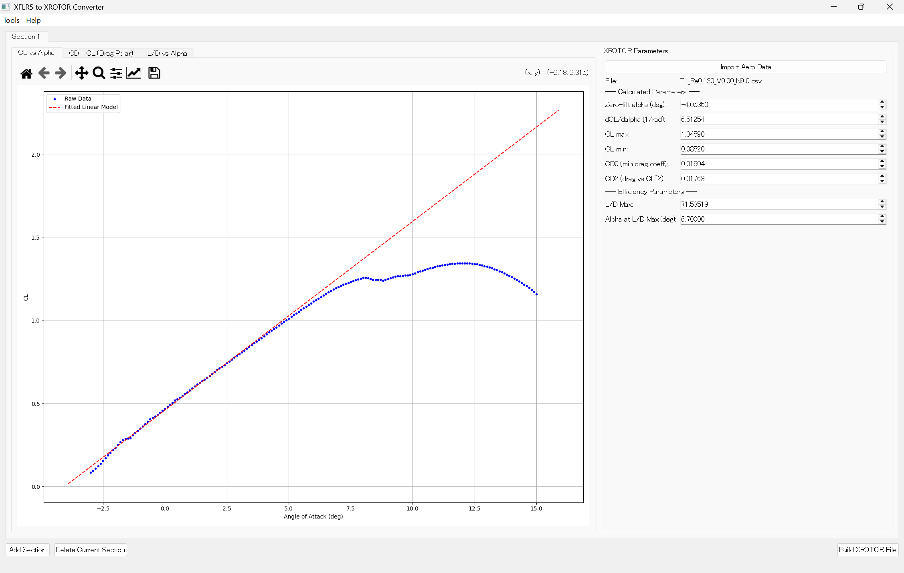
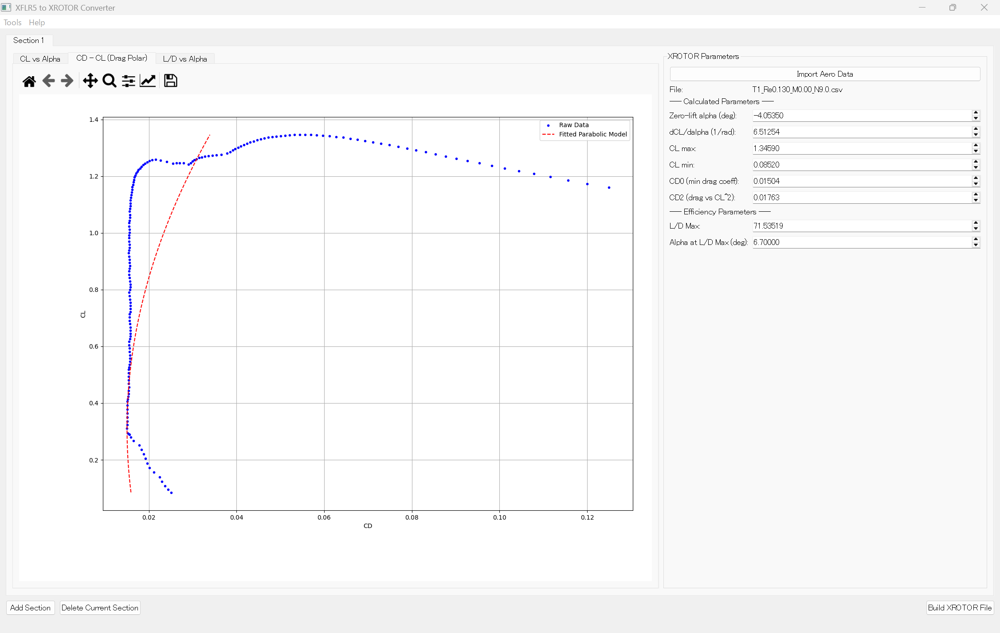

こんにちは．私はいま早稲田大学宇宙航空研究会（WASA）鳥人間プロジェクトで翼班を担当しています．

普段は主翼や尾翼の製作がメインで行っているのですが，最近プロペラ設計のサポートのお手伝いをさせて頂く機会がありました．
今回は，その際に**私が作成した設計ツール(たいしたアプリではない)**の紹介をしたいと思います．

どんんあアプリかと言いますと，**プロペラ設計ソフトXROTOR**のAEROSECTIONのパラメータ設定を自動化するツールです．[リポジトリ](https://github.com/97kuek/xflr5-to-xrotor-converter)のリンクを貼っておきますので，ぜひご参照ください．

## 目次
1. [なぜ作ったのか？](#なぜ作ったのか？)
2. [物理モデルを理解する](#物理モデルを理解する)
3. [抗力極曲線のパラメータを求める](#抗力極曲線のパラメータを求める)
4. [揚力曲線のパラメータを求める](#揚力曲線のパラメータを求める)
5. [まとめ](#まとめ)

*25年度鳥人間コンテスト出場機体のプロペラ。かっこいい！*

## なぜ作ったのか？

MITのMark Drela教授が開発した **XROTOR** は，低レイノルズ数領域におけるプロペラ設計のデファクトスタンダードです．しかし、その核心部分である翼型定義セクション（`AEROSECTION`）には、ある課題がありました．

それは、**「パラメータ設定が、設計者の"職人芸"になりがち」** という点です．

そこでXFLR5によって出力された解析データから，**「誰がやっても同じ結果になり、かつ数学的に妥当なパラメータ」** を一意に生成する手法をまとめました．

## 物理モデルを理解する

XROTORは、翼型の複雑な空力特性を，比較的シンプルな2つの**物理モデル**で表現します．目標は、XFLR5などが出力した多数のデータ点に，これらのモデル式が最もきれいにフィットするように，数式中のパラメータ（$G, \alpha_0, k$など）を見つけ出すことです．

## 1. 揚力モデル（線形モデル）
失速前，揚力係数 $C_L$ は迎角 $\alpha$ に対して線形に変化するというモデルです。
$$ C_L = G(\alpha - \alpha_0) $$
-   $G$: **揚力傾斜**。グラフの「傾き」を決めます．
-   $\alpha_0$: **ゼロリフト迎角**。グラフが横軸と交わる「位置」を決めます．

*揚力モデル(線形モデル)*

## 2. 抗力モデル（放物線モデル）
抗力係数 $C_D$ は、揚力係数 $C_L$ に対して放物線を描くというモデルです．
一般に抗力は以下のような式で表せます．

$$
C_D = C_{D,min} + k(C_L - C_{L,opt})^2
$$

$C_{D,min}$: **最小抗力係数**です．放物線の「頂点の高さ」を決めます．

$C_{L,opt}$: **最小抗力時の揚力係数**です．放物線の「頂点の横位置」を決めます．

$k$: **抗力係数**です．放物線の「開き具合」を決めます．

*抗力モデル(放物線モデル)*

ここで3つのパラメータが出てきました．では，**これらのパラメータをXFLR5の解析データからどのように求めるのか**，そのアルゴリズムを見ていきましょう。

## 抗力極曲線のパラメータを求める

まず，抗力モデルから解説します。

## 1. 最も信頼できる基準点を探す

たくさんのデータ点の中で，最も重要で，かつ最も信頼できるのはどこでしょうか？それは、**翼が最も効率よく滑空している点**，つまり**抗力が最小になる点**です。

まずデータ全体をスキャンして，**最も抗力が低い点**を直接見つけ出します．これは、`np.argmin()`のような関数を使えば一瞬で見つかります．

$$ C_{D,min} = \min(C_D) $$

$$ C_{L,opt} = C_L \text{ at } \min(C_D) $$

これで，いきなり3つのパラメータのうち2つが求まりました．あとは`k`のみです。

## 2. 形を決めるパラメータを求める

残る未知数は．放物線の"開き具合"を決める `k` だけです．これを求めるために，**変数変換**を使ってみましょう．

元の数式を，先ほど求めた $C_{D,min}$ を使って少し変形します．
$$ C_D - C_{D,min} = k(C_L - C_{L,opt})^2 $$
ここで、式の左辺を `y`、右辺の `( )` の中身の2乗を `x` と置いてみます．

$$y = C_D - C_{D,min}$$

$$x = (C_L - C_{L,opt})^2$$

ここまで来れば簡単です．手元の全データ点をこの `(x, y)` に変換し，たくさんの点になるべく近くを通る直線を引けば，その傾きが探していた `k` になります。

この「なるべく近くを通る直線を引く」処理を、数学的に最も誤差が少なくなるように自動で行ってくれるのが**最小二乗法**です．プログラムでは `np.linalg.lstsq` という関数がこの計算を実行してくれます．

## フィット範囲について
ただし，どのデータを使ってこの直線を引くかが重要です．失速領域などのノイズが多いデータの影響を排除するための工夫が必要です．プログラムでは，最小抗力点 $C_{L,opt}$ を中心に、`|C_L - C_{L,opt}| < 0.4` のように、その近傍のデータだけを厳選しています．

## 揚力曲線のパラメータを求める

揚力モデルは，抗力モデルに比べてシンプルですが，こちらも「どこが直線なのか？」を見極めるのが鍵です．

## 1. 最も"直線らしい"領域を探し出すには
ここでも、データ自身の特性から客観的に最適な領域を見つけ出します。

1.  まず、データ点を迎え角 $\alpha$ でソートします。
2.  次に、例えば10個のデータ点が入る移動窓を用意します。
3.  この移動窓を、グラフの左から右へ、少しずつスライドさせながら覗いていきます。
4.  それぞれの位置で、移動窓の中に見えるデータ点だけを使って直線を引いてみて、その「当てはまりの良さ」を評価します．この評価指標が**決定係数（R²）**で、1に近いほど完璧な直線であることを示します．
5.  データ全体をスキャンし終えたら、**最もR²が高かった場所**を、最終的な線形領域として採用します．

## 2. パラメータの算出
最適な線形領域が見つかれば，あとは簡単です．その領域のデータ群に対して改めて最小二乗法で直線をフィッティングし，傾きから**揚力傾斜 $G$** を，そして横軸との交点から**ゼロリフト迎角 $\alpha_0$** を算出します．

## まとめ

ここまで来れば，あとはプログラムに落とし込むのは容易です．私は，この理論に基づいて自動的に近似モデルを作成し，その結果をXFLR5の解析データと比較しながらパラメータを調整し，最終的に自分好みの近似モデルに仕上げられるような[Pythonプログラム](https://github.com/97kuek/xflr5-to-xrotor-converter)を作成しました．

もしご質問やご意見などがあれば，コメントにてご連絡ください！それでは！