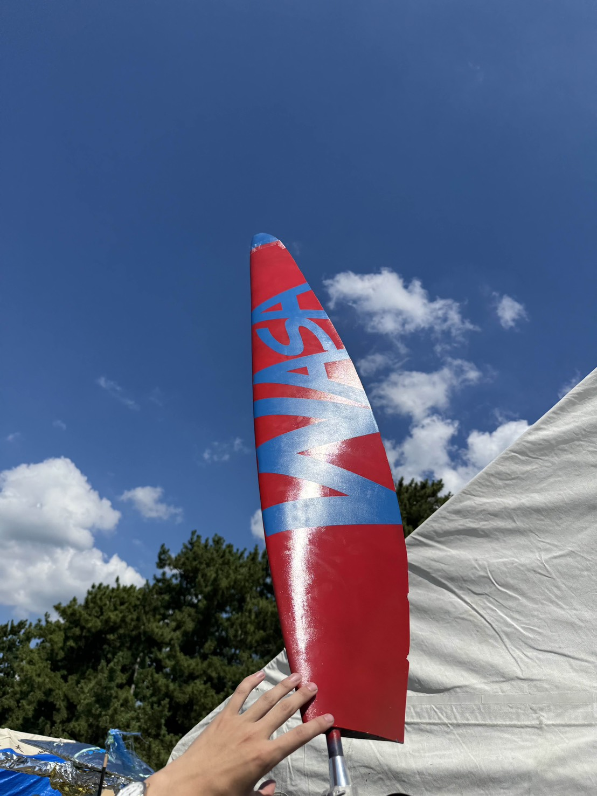

## はじめに：なぜこれを作ったのか

こんにちは。早稲田大学宇宙航空研究会（WASA）鳥人間プロジェクトで翼班をやっている植木です。 普段は主翼や尾翼の製作がメインですが、最近はプロペラ設計のサポートも行っています。

人力飛行機のプロペラ設計において、MITのMark Drela教授が開発した **XROTOR** は、低レイノルズ数領域における最適設計のデファクトスタンダードです。しかし、その核心部分である翼型定義セクション（`AEROSECTION`）には、長年抱えられてきた課題がありました。

**「パラメータ設定が、設計者の"職人芸"になりがち」**

XROTORは計算コスト削減のため、翼型特性を生の極曲線データ（Polar Curve）ではなく、いくつかの係数を用いた**近似関数**として保持します。従来、これらの値はグラフを目視して定規を当てたり、手計算で算出したりしていましたが、以下の問題が常につきまといました。

1.  **再現性の欠如**: 人によって読み取る値が変わる。
2.  **物理的整合性**: どこまでを線形領域とするか、どの範囲でフィッティングするかという基準が曖昧。

本ブログは、XFLR5による粘性解析データを「正」とし、統計的処理によって**誰がやっても同じ、かつ物理的に妥当なパラメータ**を一意に生成することを目的としています。


*25年度鳥人間コンテストのプロペラの写真，かっこいい！*

## 目次
1. [AEROSECTIONの13パラメータ](#aerosectionの13パラメータ)
2. [理論的背景](#理論的背景)

## AEROSECTIONの13パラメータ

XROTORのAEROメニューで要求されるのは以下の13項目です。本ツールはこれら全てを自動計算します。

| No. | Parameter | Symbol | Description |
| :--- | :--- | :---: | :--- |
| 1 | **Alpha at Zero Lift** | $\alpha_{0}$ | 揚力が0になる迎え角 |
| 2 | **Lift Slope** | $dC_L/d\alpha$ | 線形区間における揚力傾斜 |
| 3 | **Lift Slope @stall** | - | 失速直前の揚力傾斜 |
| 4 | **Max CL** | $C_{L,max}$ | 最大揚力係数 |
| 5 | **Min CL** | $C_{L,min}$ | 最小揚力係数 |
| 6 | **CL increment to stall** | $\Delta C_L$ | 線形域終端から完全失速までの$C_L$増加分 |
| 7 | **Min Drag** | $C_{D,min}$ | 最小抗力係数 |
| 8 | **Drag Scaling Factor** | $k$ | 抗力曲線の広がり係数 ($dC_D/dC_L^2$) |
| 9 | **CL at Min Drag** | $C_{L,opt}$ | 最小抗力を与える揚力係数 |
| 10 | **Ref. Re Number** | $Re_{ref}$ | 解析レイノルズ数 |
| 11 | **Re Scaling Exp** | $n$ | レイノルズ数スケーリング指数 |
| 12 | **Cm** | $C_m$ | ピッチングモーメント係数 |
| 13 | **Mcrit** | $M_{crit}$ | 臨界マッハ数 |

---

## アルゴリズムと理論背景

本ツールが採用しているパラメータ導出ロジックの詳細です。

### 1. 線形領域のフィルタリング

低レイノルズ数領域では、層流剥離泡（Laminar Separation Bubble）の崩壊や前縁失速により、揚力・抗力曲線は急激な非線形性を示します。XROTORのポテンシャル流モデルに適合させるため、まずは「流れが安定して付着している領域」のみを抽出する必要があります。

本ツールでは、ドラッグポーラー上の局所的な微分係数（差分）$s_i$ を評価関数として定義します。

$$
s_i = \frac{d C_D}{d C_L} \approx \frac{C_{D,i+1} - C_{D,i}}{C_{L,i+1} - C_{L,i}}
$$

経験則に基づき、$\left| s_i \right| < 0.05$ を満たすデータ点集合 $\mathcal{D}_{linear}$ を「線形領域」として抽出し、以降の解析に使用します。

### 2. 抗力モデルの同定

XROTORの内部では、抗力係数 $C_D$ は揚力係数 $C_L$ に対して放物線を描くと仮定されます。

$$
C_D(C_L) = C_{D,min} + k (C_L - C_{L,opt})^2
$$

この式を展開すると、$C_L$ に関する二次方程式となります。
$$
C_D(C_L) = k C_L^2 - 2k C_{L,opt} C_L + (k C_{L,opt}^2 + C_{D,min})
$$

そこで、抽出したデータセット $\mathcal{D}_{linear}$ に対して最小二乗法を用い、以下の一般形2次多項式へのフィッティングを行います。

$$
C_D = a {C_L}^2 + b {C_L} + c
$$

係数比較を行うことで、XROTORのパラメータは数学的に一意に決定されます。

* **$d(C_D)/d(C_L^2)$ ($k$)**:  
    二次項の係数そのものです。
    $$k = a$$
* **$C_L$ at Minimum $C_D$ ($C_{L,opt}$)**:  
    放物線の頂点のX座標です。
    $$C_{L,opt} = -\frac{b}{2a}$$
* **Min Drag ($C_{D,min}$)**:  
    放物線の頂点のY座標です。
    $$C_{D,min} = c - \frac{b^2}{4a}$$

### 3. 揚力特性の同定

揚力曲線についても、ポテンシャル流理論および粘性デキャンバー効果（Viscous Decambering）を考慮した線形モデルを仮定します。

$$
C_L(\alpha) = \frac{dC_L}{d\alpha} (\alpha - \alpha_{0})
$$

単純な全点回帰を行うと、失速付近の非線形データに引っ張られて傾きが過小評価されるリスクがあります。そのため、本ツールでは**「抗力が最小となる点（＝最も流れが綺麗な点）」**近傍の微小差分を用いて、実効的な揚力傾斜を算出します。

$$
\frac{dC_L}{d\alpha} \approx \frac{C_{L,opt+\delta} - C_{L,opt-\delta}}{\alpha_{opt+\delta} - \alpha_{opt-\delta}}
$$

ゼロ揚力角 $\alpha_{0}$ は、算出された傾きを用いて逆算により求められます。

---

## 使い方 (Usage)

### 必要要件
* Python 3.10+
* pandas, numpy, scipy

### 実行手順

1.  **リポジトリのクローン**
    ```bash
    git clone [https://github.com/97kuek/xflr5-to-xrotor-converter.git](https://github.com/97kuek/xflr5-to-xrotor-converter.git)
    cd xflr5-to-xrotor-converter
    ```

2.  **データの準備**
    `input` ディレクトリを作成し、XFLR5からエクスポートしたCSVファイルを配置してください。

3.  **解析の実行**
    ```bash
    python main.py
    ```

4.  **結果の利用**
    コンソールに出力された値を、XROTORの `AERO` メニューに入力してください。